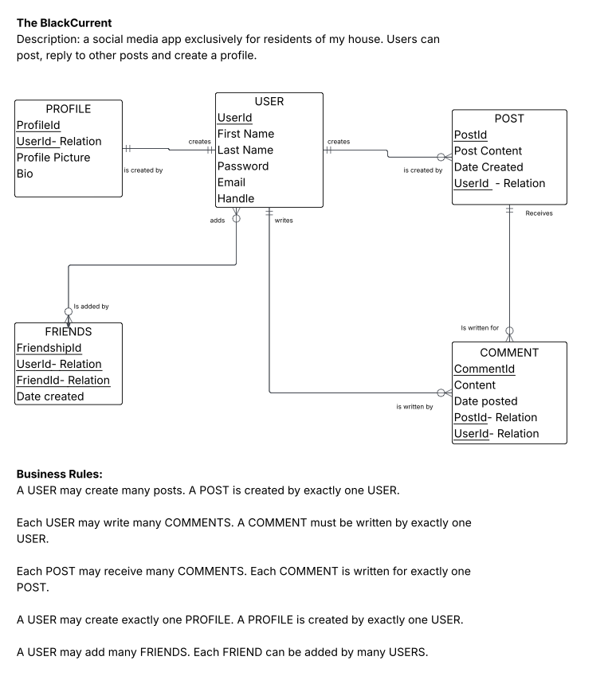
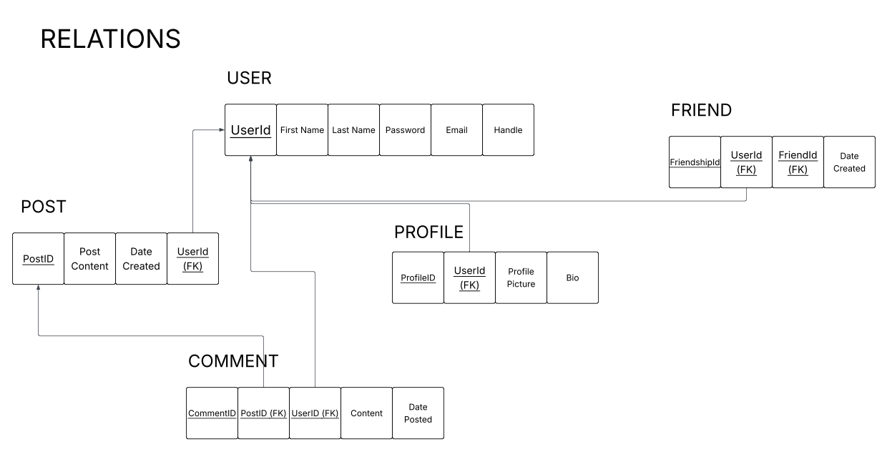

# The BlackCurrant

For this project, I want to create a social media site specifically for members of my house. There are 8 of us and they have actually been asking me to create something for ourselves for a while (since one of us doesn't like traditional social media).  

Users will be able to post, customize their profile, and add each other as friends to keep up with the happenings going on inside our house.   

This is a second version of this website (The BlackCurrant) using MongoDB as the database, and will have updated features and capabilities (such as profile customization, more dynamic posting and timelines, etc.).

## ERD

This is the ERD and business rules for my proposed social media. This outlines the different entities I will be defining in my database. Basically, all of the information about a user will be stored in these entities and their associated attributes. 

This is then the relations in 3NF form for my site. This is how each entity relates to each other and builds on each other.

